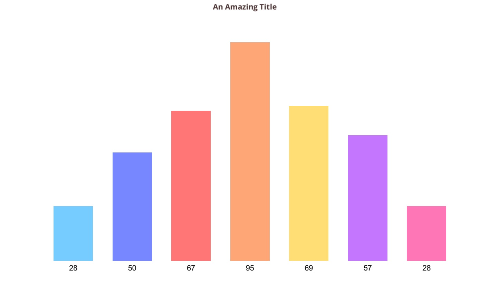
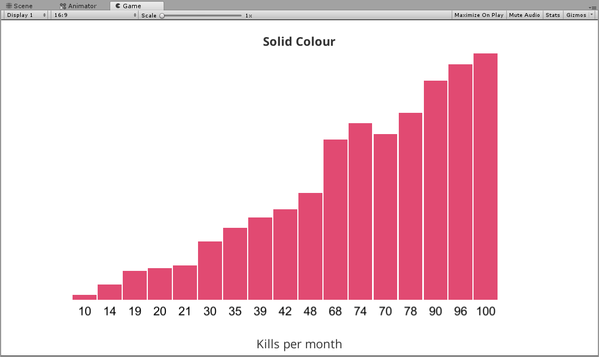
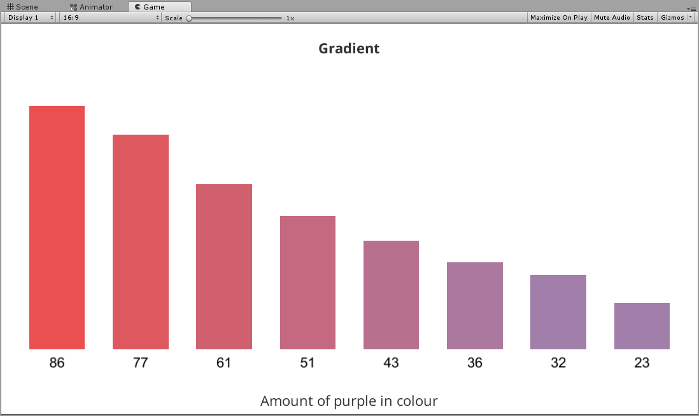
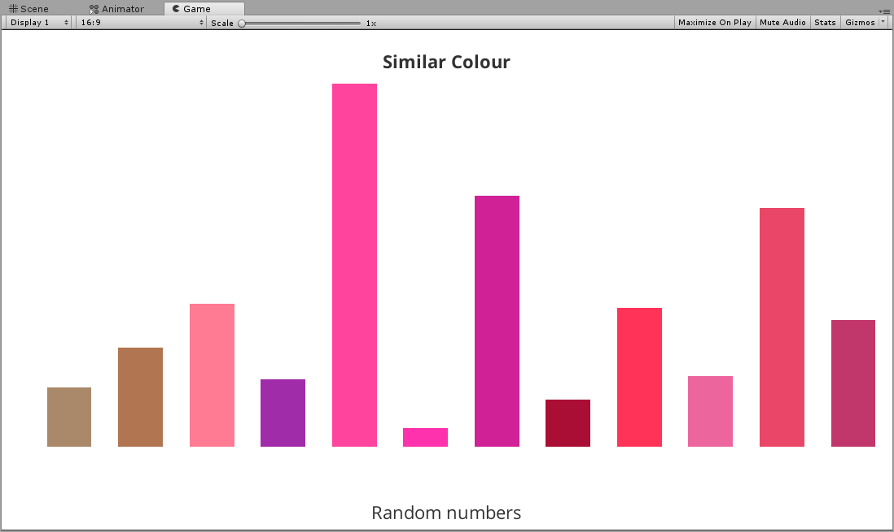
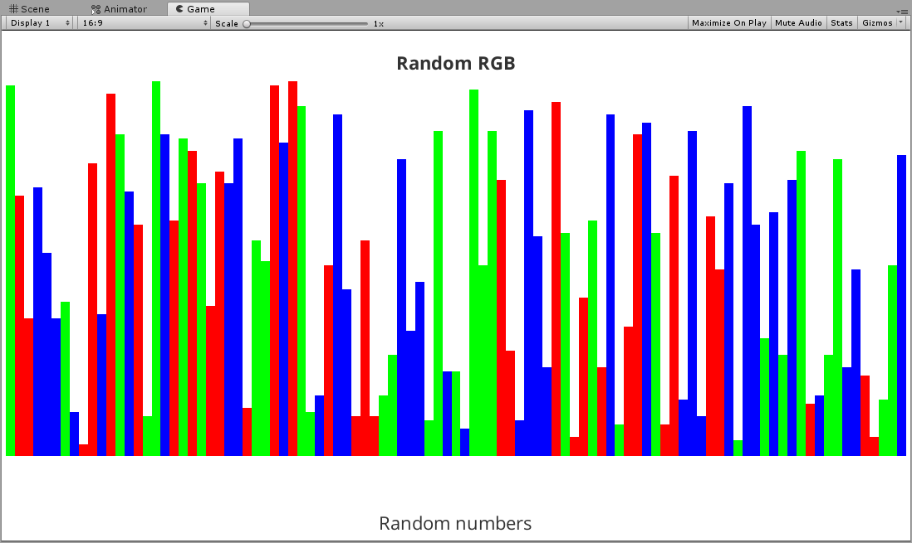
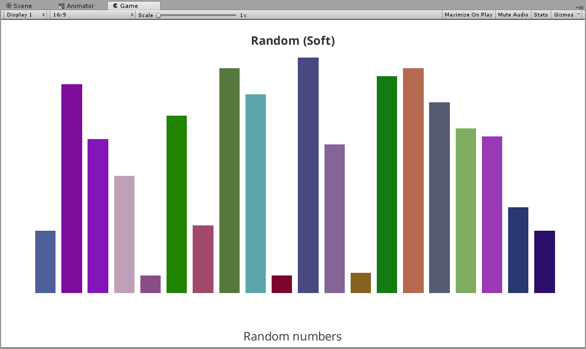

# Bar Chart

### Description
A bar chart implemented in Unity, with help from the [Percentage Based](https://github.com/LewisJohnson/unity-ui-examples/tree/master/Assets/ScreenSpace/PercentageBased) example. It includes an custom editor for creating and editing your bar chart.

| Custom                  | Solid            | Gradient            | Similar Shade            |
|-------------------------|------------------|---------------------|--------------------------|
|  |  |  |  |

| Similar Colour            | Random            | Random Soft            | Random RGB            |
|---------------------------|------------------|---------------------|--------------------------|
|  |  |  |  |

#### Included: 
* Bar chart
* Custom bar chart Editor
* Multipule chart colour settings
* Title, X-Axis and Y-axis labels

### Supported aspect ratios
* 5:4 ✅
* 4:3 ✅
* 3:2 ✅
* 16:10 ✅
* 16:9 ✅

### Supported Platforms
* Editor ✅
* Standalone ✅
* UWP ✅

**Mobile**
* iOS ✅
* Android ✅

**Console**
* Xbox One ✅
* PS4 ✅

### Parameters
* Class
	* Field - This is a field description.
	* **SubClass Position**
		* Field - This is a field description.
		* Field - This is a field description.
	* **SubClass**
		* Field - This is a field description.
		* Field - This is a field description.