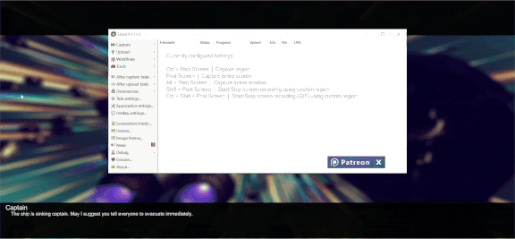

# Offest UI

### Description
This UI example is inspired by games such as No Man's Sky and Destiny, where the UI offsets to the Joystick/Mouse movement. The black bars included are optional as the container is offset, not the children individually.

### Supported aspect ratios
* 5:4 ✅
* 4:3 ✅
* 3:2 ✅
* 16:10 ✅
* 16:9 ✅

### Supported Platforms
* Editor ✅
* Standalone ✅
* UWP ✅
* **Mobile** ❌

**Console**
* Xbox One ✅
* PS4 ✅

### Parameters
* Offest UI
  * X Clamp Max - The clamp on the offset of the container's local x position.
  * Y Clamp Max - The clamp on the offset of the container's local y position.
  * Blackbar Percentage - The percentage of black bar covering the screen. 25% would be 50% of the screen covered, because there is a top and bottom bar.
  * Sensitivity - How sensitive the offset is to player input.
  * Invert Offset - If the offset is oposite to the player's input or not.
  * Controller Offset - You can disable offset for controllers.
