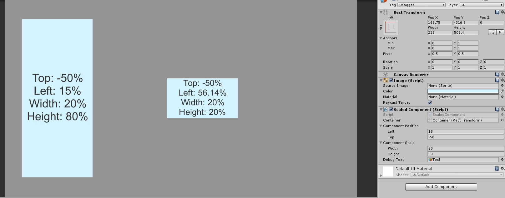

# Percentage Based UI

### Description
This UI example is inspired by css, letting the developer create components with left/top and width/height values.
Scales well with any screen imaginable.

### Supported aspect ratios
* 5:4 ✅
* 4:3 ✅
* 3:2 ✅
* 16:10 ✅
* 16:9 ✅

### Supported Platforms
* Editor ✅
* Standalone ✅
* UWP ✅

**Mobile** ❓
* iOS ❓
* Android ❓

**Console**
* Xbox One ✅
* PS4 ✅

### Parameters
* Scaled Component
	* Container - The container rect transform the component percentages are based off.
	* **Component Position**
		* Left - Left percentage from containers left side.
		* Top - Top percentage from containers top side.
	* **Component Scale**
		* Width - Width percentage of containers width.
		* Height - height percentage of containers height.
	
