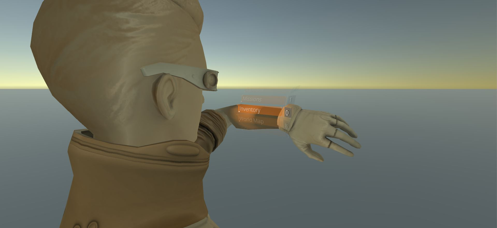

# Holographic Wrist UI
 | 
:-----------------------------------------------------:|:-----------------------------------------------------:

### Description
This UI is inspired by [Tom Clancy's The Division](https://tomclancy-thedivision.ubisoft.com/game/en-us/home/)'s cancelled [hologrpahic wrist UI](https://www.hudsandguis.com/home/2013/06/26/tom-clancys-the-division-interface-design).

#### Included: 
* Ethan with UI attached to left wrist

#### Todo:
* Animations
* Improve style

### Supported aspect ratios
* 5:4 ✅
* 4:3 ✅
* 3:2 ✅
* 16:10 ✅
* 16:9 ✅

### Supported Platforms
* Editor ✅
* Standalone ✅
* UWP ✅

**Mobile**
* iOS ✅
* Android ✅

**Console**
* Xbox One ✅
* PS4 ✅
